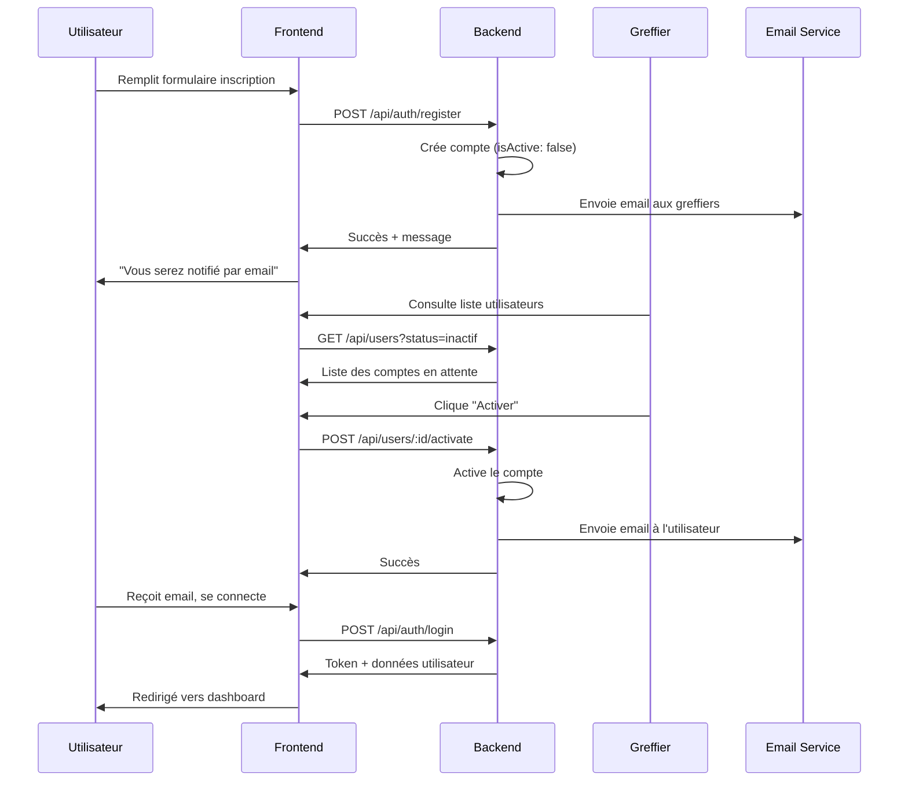

# 🔐 MODULE D'AUTHENTIFICATION & GESTION DES UTILISATEURS

## Vue d'ensemble

Ce module fournit un système complet d'authentification et de gestion des utilisateurs pour la plateforme e-Justice Sénégal avec workflow d'activation des comptes.

## ✨ Fonctionnalités implémentées

### 1. Authentification sécurisée

#### Connexion
- ✅ Validation de l'email et du mot de passe
- ✅ Vérification du statut d'activation du compte
- ✅ Messages d'erreur détaillés et sécurisés
- ✅ Journalisation automatique de toutes les tentatives de connexion
- ✅ Détection des tentatives de connexion échouées
- ✅ Redirection automatique selon le rôle de l'utilisateur
- ✅ Mise à jour du dernier accès

#### Inscription (Workflow avec activation)
- ✅ Formulaire complet avec validation
- ✅ Vérification de l'unicité de l'email
- ✅ Validation du format email
- ✅ Validation de la force du mot de passe (minimum 6 caractères)
- ✅ Validation du numéro de téléphone
- ✅ Attribution automatique de rôle
- ✅ **Compte créé inactif** jusqu'à validation par le greffier
- ✅ Champ tribunal conditionnel (pour Greffier, Juge, Procureur)
- ✅ Rôle Admin exclu de l'inscription publique
- ✅ **Notification automatique aux greffiers** (email + in-app)
- ✅ Message à l'utilisateur : "Vous recevrez un email dès activation"

### 2. Workflow d'Activation des Comptes

```
┌─────────────────┐     ┌─────────────────┐     ┌─────────────────┐
│   INSCRIPTION   │────▶│  EN ATTENTE     │────▶│  COMPTE ACTIF   │
│   (Utilisateur) │     │  (Greffier)     │     │  (Connexion OK) │
└─────────────────┘     └─────────────────┘     └─────────────────┘
         │                       │                       │
         ▼                       ▼                       ▼
   Message toast          Email envoyé            Email envoyé
   "Vous serez           aux greffiers           à l'utilisateur
    notifié"                                      avec accès
```

#### Notifications automatiques :

1. **À l'inscription** :
   - ✉️ Email aux greffiers avec détails du compte
   - 🔔 Notification in-app aux greffiers
   - 💬 Toast à l'utilisateur confirmant la demande

2. **À l'activation** :
   - ✉️ Email à l'utilisateur avec confirmation
   - 🔔 Notification in-app à l'utilisateur
   - ℹ️ Informations de connexion incluses

### 3. Gestion des utilisateurs (Greffier/Admin)

#### CRUD complet
- ✅ **Création** : Ajout de nouveaux utilisateurs (compte actif par défaut)
- ✅ **Lecture** : Affichage de la liste complète avec filtrage
- ✅ **Modification** : Édition des informations utilisateur
- ✅ **Suppression** : Suppression avec confirmation (Admin uniquement)
- ✅ **Activation** : Activer un compte en attente
- ✅ **Désactivation** : Suspendre un compte actif

#### Restrictions par rôle :
| Action | Admin | Greffier |
|--------|-------|----------|
| Voir tous les utilisateurs | ✅ | ✅ (sauf Admin/Greffier) |
| Créer un utilisateur | ✅ Tous rôles | ✅ Sauf Admin/Greffier |
| Activer/Désactiver | ✅ Tous | ✅ Sauf Admin/Greffier |
| Supprimer | ✅ | ❌ |

#### Filtres disponibles
- Par rôle (Admin, Greffier, Juge, Procureur, Avocat, Justiciable)
- Par statut (Actif, Inactif)
- Par recherche (nom, prénom, email)

### 4. Profil utilisateur

#### Informations personnelles
- ✅ Photo de profil avec upload
- ✅ Prénom, Nom
- ✅ Email
- ✅ Téléphone
- ✅ Tribunal d'affectation (si applicable)
- ✅ Rôle/Fonction (lecture seule)
- ✅ Statut du compte (Actif/Inactif)

#### Mode édition
- ✅ Activation/désactivation du mode édition
- ✅ Upload de photo avec prévisualisation
- ✅ Validation des modifications
- ✅ Annulation des changements
- ✅ Sauvegarde avec confirmation

#### Sécurité & Activité
- ✅ Affichage du dernier accès
- ✅ Historique des connexions
- ✅ Détails : date, heure, adresse IP

### 5. Gestion des rôles et permissions

#### Rôles disponibles

| Rôle | Code | Tribunal requis | Peut s'inscrire |
|------|------|-----------------|-----------------|
| Administrateur | `admin` | Non | ❌ Non |
| Greffier | `greffier` | ✅ Oui | ✅ Oui |
| Juge | `juge` | ✅ Oui | ✅ Oui |
| Procureur | `procureur` | ✅ Oui | ✅ Oui |
| Avocat | `avocat` | Non | ✅ Oui |
| Justiciable | `justiciable` | Non | ✅ Oui |

#### Permissions par rôle

1. **Administrateur** (`admin`)
   - Gestion complète des utilisateurs
   - Accès aux logs d'audit
   - Statistiques système
   - Configuration

2. **Greffier** (`greffier`)
   - Activation/désactivation des comptes
   - Création et gestion des audiences
   - Gestion des salles
   - Génération d'affichages
   - Envoi de notifications

3. **Juge** (`juge`)
   - Consultation des audiences assignées
   - Rédaction de décisions
   - Envoi d'instructions au greffe
   - Accès aux dossiers

4. **Procureur** (`procureur`)
   - Suivi des affaires du ministère public
   - Accès aux réquisitoires
   - Consultation des audiences

5. **Avocat** (`avocat`)
   - Gestion des dossiers clients
   - Téléversement de pièces
   - Notifications d'audiences
   - Consultation des décisions

6. **Justiciable** (`justiciable`)
   - Consultation de son affaire
   - Informations sur son audience
   - Accès au résumé du dossier

## 🔒 Sécurité

### Mesures implémentées

1. **Authentification Backend**
   - Hash des mots de passe avec bcrypt (12 rounds)
   - JWT avec access token (7 jours) et refresh token (30 jours)
   - Vérification du statut actif avant connexion

2. **Contrôle d'accès**
   - Middleware d'authentification sur toutes les routes protégées
   - Vérification des rôles au niveau des contrôleurs
   - Filtrage des données par rôle

3. **Audit & Traçabilité**
   - Tous les événements sont tracés
   - Logging de toutes les actions d'authentification
   - Détection d'activités suspectes

4. **Validation des données**
   - Validation côté frontend et backend
   - Format email vérifié
   - Mot de passe avec longueur minimale
   - Unicité des emails

## 📝 API Endpoints

### Authentification (`/api/auth`)

| Méthode | Route | Description |
|---------|-------|-------------|
| POST | `/register` | Inscription (compte inactif) |
| POST | `/login` | Connexion |
| POST | `/logout` | Déconnexion |
| POST | `/refresh-token` | Renouveler le token |
| POST | `/forgot-password` | Mot de passe oublié |
| POST | `/reset-password` | Réinitialiser mot de passe |

### Utilisateurs (`/api/users`)

| Méthode | Route | Description | Rôles |
|---------|-------|-------------|-------|
| GET | `/me` | Profil actuel | Tous |
| PUT | `/me` | Modifier profil | Tous |
| GET | `/` | Liste utilisateurs | Admin, Greffier |
| POST | `/` | Créer utilisateur | Admin, Greffier |
| GET | `/:id` | Profil utilisateur | Admin, Greffier |
| POST | `/:id/activate` | Activer compte | Admin, Greffier |
| POST | `/:id/deactivate` | Désactiver compte | Admin, Greffier |
| DELETE | `/:id` | Supprimer utilisateur | Admin |

## 📧 Templates Email

### Email de notification aux greffiers (nouveau compte)

```
Sujet: 🔔 Nouveau compte en attente d'activation

Contenu:
- Nom de l'utilisateur
- Email
- Rôle demandé
- Lien vers la page de gestion des utilisateurs
```

### Email d'activation à l'utilisateur

```
Sujet: ✓ Votre compte e-Justice Sénégal a été activé

Contenu:
- Message de bienvenue personnalisé
- Détails du compte (rôle, statut)
- Lien de connexion
- Instructions
```

## 📝 Comptes de test

Pour tester l'application, utilisez ces comptes (après seed) :

| Email | Mot de passe | Rôle |
|-------|-------------|------|
| admin@ejustice.sn | Admin123! | Administrateur |
| greffier@ejustice.sn | Greffier123! | Greffier |
| juge@ejustice.sn | Juge123! | Juge |
| procureur@ejustice.sn | Procureur123! | Procureur |
| avocat@ejustice.sn | Avocat123! | Avocat |
| justiciable@ejustice.sn | Justiciable123! | Justiciable |

## 🎨 Interface utilisateur

### Pages principales
1. `/auth` - Page de connexion/inscription
2. `/common/profile` - Profil utilisateur
3. `/greffier/users` - Gestion des utilisateurs (Greffier)
4. `/admin/users` - Gestion des utilisateurs (Admin)
5. `/admin/audit` - Journal d'audit (Admin)

### Composants clés
- `Auth.tsx` - Formulaires connexion/inscription
- `Users.tsx` - Table de gestion avec filtres
- `Profile.tsx` - Page profil avec édition
- `ProtectedRoute.tsx` - Protection des routes

## 🔄 Flux d'inscription complet



## 🚀 Évolutions futures

- [ ] Authentification à deux facteurs (2FA)
- [ ] Verrouillage de compte après X tentatives échouées
- [ ] Politique de mot de passe renforcée
- [ ] Réinitialisation de mot de passe par SMS
- [ ] Notifications push mobiles
- [ ] OAuth (Google, Microsoft)

## 📚 Fichiers concernés

### Frontend
```
src/
├── pages/Auth.tsx                    # Connexion/Inscription
├── pages/common/Profile.tsx          # Profil utilisateur
├── pages/greffier/Users.tsx          # Gestion utilisateurs (Greffier)
├── pages/admin/Users.tsx             # Gestion utilisateurs (Admin)
├── contexts/AppContext.tsx           # État global, authentification
├── components/ProtectedRoute.tsx     # Protection des routes
└── services/api.ts                   # Client API
```

### Backend
```
backend/src/
├── controllers/auth.controller.ts    # Logique authentification
├── controllers/user.controller.ts    # Gestion utilisateurs
├── routes/auth.routes.ts             # Routes authentification
├── routes/user.routes.ts             # Routes utilisateurs
├── middleware/auth.ts                # Middleware JWT
└── services/notification.service.ts  # Envoi notifications
```

---

**Version** : 2.0.0  
**Dernière mise à jour** : Décembre 2025  
**Auteur** : e-Justice Sénégal
